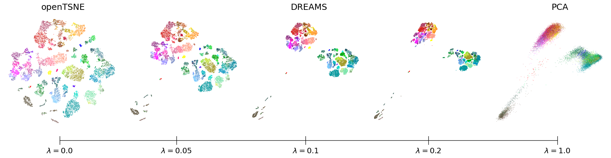
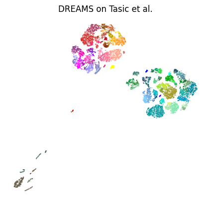

DREAMS
========

This repossitory contains the code of the method presented in "DREAMS: Preserving both Local and Global Structure in Dimensionality Reduction".

DREAMS (Dimensionality Reduction Enhanced Across Multiple Scales) combines the local structure preservation of $t$-SNE with the global structure preservation of PCA via a regularization term that motivates global structure preservation. It provides a continuum of embeddings along a local-global spectrum with almost no local/global structure preservation tradeoff.

<p align="center">

The code builds upon [openTSNE](https://github.com/pavlin-policar/openTSNE), which is the $t$-SNE backend that DREAMS is using.

# Installation
To use the method you must follow these steps:
````
git clone --branch tp --single-branch https://github.com/NavidadK/DREAMS.git
cd openTSNE
python setup.py install
````
# Usage example
DREAMS is using a precomputed reference embedding that is responsible for the global layout of the embedding. Per default DREAMS is using the PCA embedding, but other embeddings such as the MDS embedding can be used as well. The regularization strength determines the influence of the regularization-embedding on the final embedding. Its default regualrization strength is $\lambda=0.1$, which experimentally showed to effectively keep the local strcuture preservation of $t$-SNE and simultaneously the global structure preservation of PCA.

Here is an example on the Tasic et al. dataset[^tasic]
````python
import openTSNE
from openTSNE import TSNE

# Load data
tasic_data = np.load('data/tasic/tasic-pca50.npy')
# Scaled first 2 PCs
tasic_pca2 = tasic_data[:, :2]
tasic_reg_emb = tasic_pca2 / tasic_pca2[:,0].std()

# DREAMS
embedder = TSNE(initialization=tasic_reg_emb, 
                regularization=True, 
                reg_lambda=0.1, 
                reg_embedding=tasic_reg_emb)
tasic_dreams = embedder.fit(data)

# Plot the embedding
tasic_colors = np.load('data/tasic/tasic-colors.npy')

plt.figure()
plt.scatter(*tasic_dreams.T, c=tasic_colors, alpha=0.5, s=1.0, edgecolor="none")
plt.gca().set_aspect("equal")
plt.axis("off")
plt.title("DREAMS")
plt.show()
````
<p align="center">

# References
[^tasic]: Bosiljka Tasic, Zizhen Yao, Lucas T Graybuck, Kimberly A Smith, Thuc Nghi Nguyen, Darren Bertag-
nolli, Jeff Goldy, Emma Garren, Michael N Economo, Sarada Viswanathan, et al. Shared and distinct
transcriptomic cell types across neocortical areas. Nature, 563(7729):72–78, 2018.
